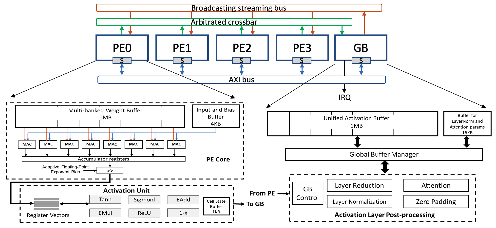

FlexASR
========

FlexASR is an AXI-programmable hardware accelerator for attention-based seq-to-seq networks. FlexASR can be configured to accelerate end-to-end RNN, GRU or LSTM models with attention mechanisms. It was designed in Synthesizable SystemC followed by high-level synthesis (HLS) in order to generate RTL. 



# Getting Started

## Tool versions and environment setup

C++ simulation and HLS of FlexASR top-level and children modules have been verified to work with the following tool versions:

* `gcc` - 4.9.3 (with C++11)
* `systemc` - 2.3.1
* `boost` - 1.55.0 
* `catapult` - 10.5a

In the cmod/cmod_Makefile, please provide the correct tool installation paths for BOOST_HOME, SYSTEMC_HOME and CATAPULT_HOME 

## Directory structure

* `cmod/include/*.h` contains header files for functions and classes from FlexASR
* `cmod/<module>` sub-directories contain FlexASR SystemC modules
* `matchlib` library of synthesizable hardware components from NVIDIA

## Build and run

### C++ compile and simulation of SystemC module

The following commands run C++ compilation and simulation of the FlexASR accelerator top-level, executing 4 LSTM timesteps.

    git clone --recursive https://github.com/harvard-acc/FlexASR.git
    cd cmod/Top
    make
    make run


# Citation

If you find this resource useful, please consider citing the following paper:
```
@inproceedings{Tambe_isscc2021,
  title = {A 25mm2 SoC for IoT Devices with 18ms Noise Robust Speech-to-Text Latency
           via Bayesian Speech Denoising and Attention-Based Sequence-to-Sequence
           DNN Speech Recognition in 16nm FinFET},
  author = {Thierry Tambe and En-Yu Yang and Glenn G. Ko and Yuji Chai
            and Coleman Hooper and Marco Donato and Paul N. Whatmough 
            and Alexander M. Rush and David Brooks and Gu-Yeon Wei},
  booktitle = {International Solid-State Circuits Conference (ISSCC)},
  year = {2021}
}
```
FlexASR was inspired by the Simba architecture. Please also consider citing the following paper:  
```
@inproceedings{Shao_micro2019, 
  author = {Shao, Yakun Sophia and Clemons, Jason and Venkatesan, Rangharajan and
            Zimmer, Brian and Fojtik, Matthew and Jiang, Nan and Keller, Ben and
            Klinefelter, Alicia and Pinckney, Nathaniel and Raina, Priyanka and Tell,
            Stephen G. and Zhang, Yanqing and Dally, William J. and Emer, Joel and Gray, C.
            Thomas and Khailany, Brucek and Keckler, Stephen W.},
  title = {Simba: Scaling Deep-Learning Inference with Multi-Chip-Module-Based Architecture},
  publisher = {Association for Computing Machinery},
  address = {New York, NY, USA},
  booktitle = {Proceedings of the 52nd Annual IEEE/ACM International Symposium on Microarchitecture},
  year = {2019},
  pages = {14–27},
  numpages = {14},
  keywords = {accelerator architecture, Multi-chip module, neural networks}
}
```
# Contact Us
For any further questions please contact ttambe@g.harvard.edu
